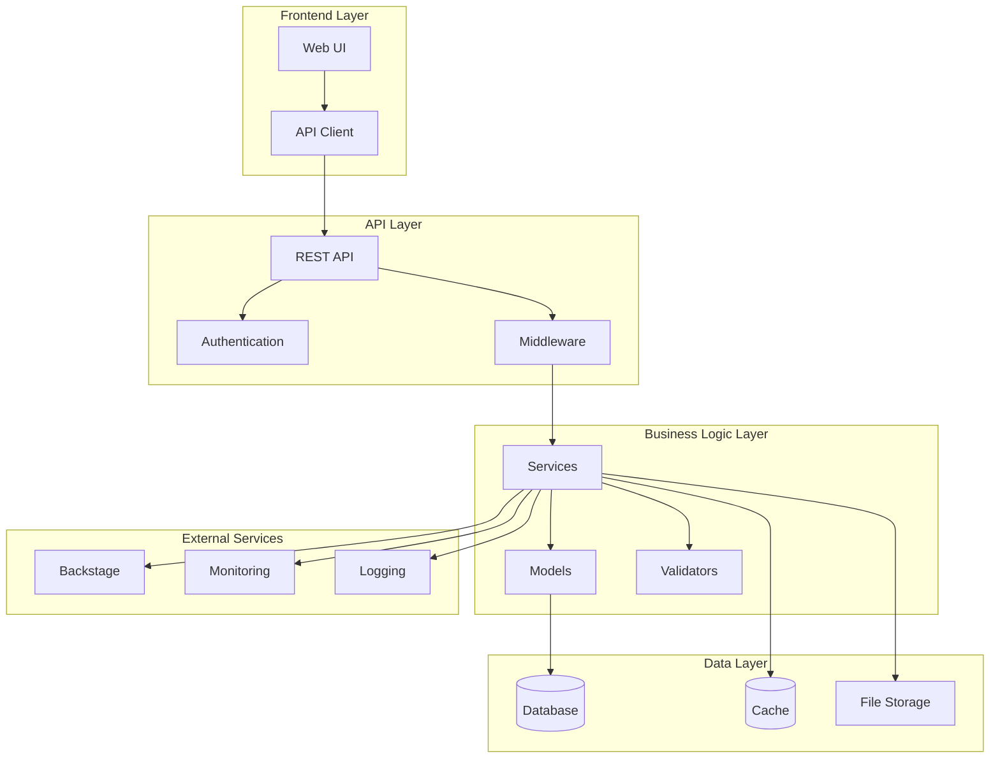
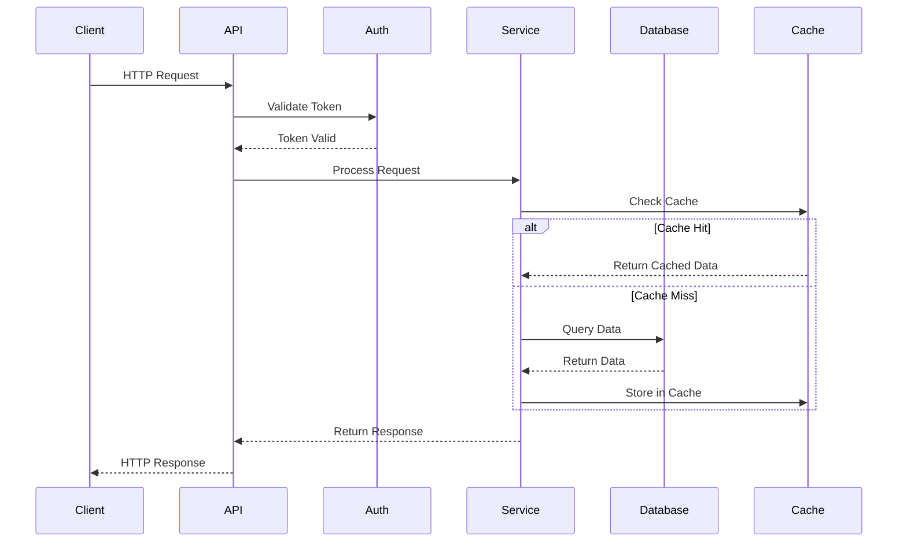
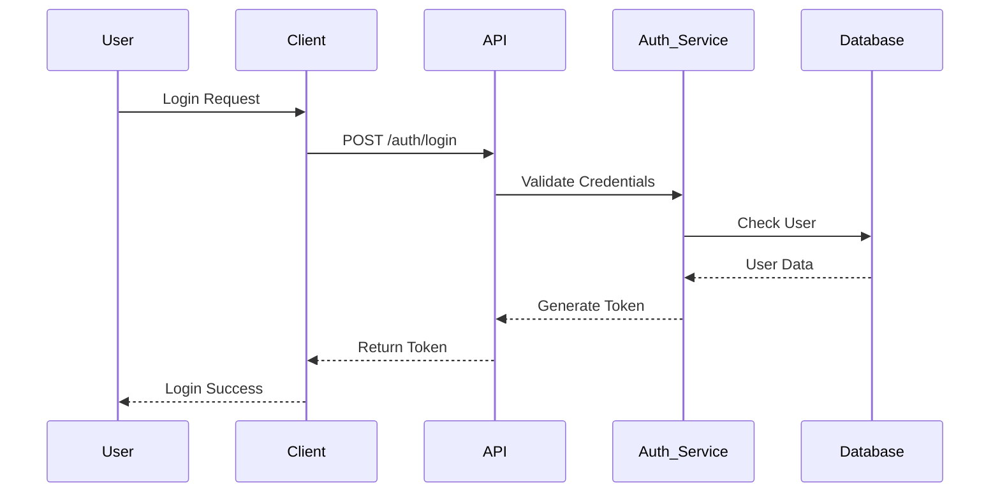
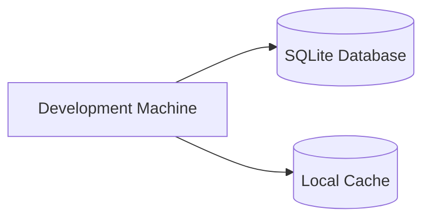
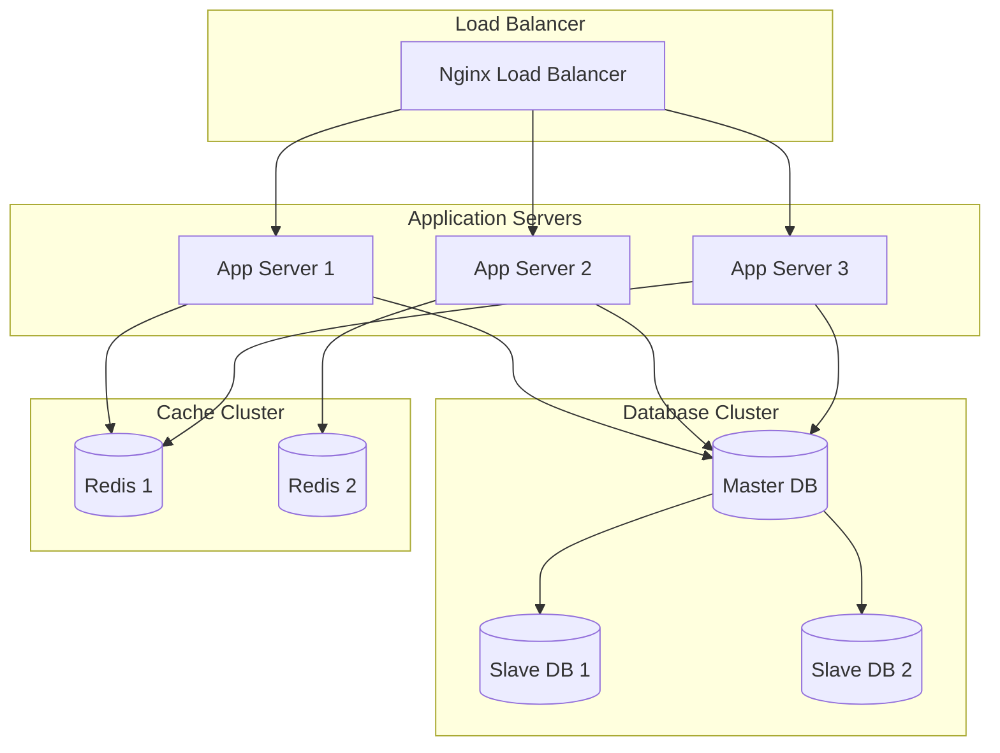

# Architecture Overview

This document provides a high-level overview of the Backstage Test Project architecture, including system components, data flow, and integration patterns.

## System Architecture



## Component Overview

### Frontend Layer

The frontend layer handles user interactions and presents data to users.

**Components:**
- **Web UI**: Django templates and static files
- **API Client**: JavaScript client for API communication

**Responsibilities:**
- User interface rendering
- User input handling
- API communication
- Client-side validation

### API Layer

The API layer provides a RESTful interface for client applications.

**Components:**
- **REST API**: Django REST Framework endpoints
- **Authentication**: Token-based authentication system
- **Middleware**: Request/response processing

**Responsibilities:**
- Request routing
- Authentication and authorization
- Input validation
- Response formatting
- Error handling

### Business Logic Layer

The business logic layer contains the core application logic.

**Components:**
- **Services**: Business logic implementation
- **Models**: Data models and relationships
- **Validators**: Data validation logic

**Responsibilities:**
- Business rule enforcement
- Data processing
- Integration with external services
- Transaction management

### Data Layer

The data layer manages data persistence and retrieval.

**Components:**
- **Database**: SQLite for development, PostgreSQL for production
- **Cache**: Redis for caching frequently accessed data
- **File Storage**: Local filesystem or cloud storage

**Responsibilities:**
- Data persistence
- Query optimization
- Data integrity
- Backup and recovery

## Data Flow

### Request Processing Flow



### Data Synchronization

The system maintains data consistency through:

1. **Database Transactions**: ACID compliance for critical operations
2. **Cache Invalidation**: Automatic cache updates on data changes
3. **Event-Driven Updates**: Real-time updates via webhooks
4. **Backup Strategies**: Regular automated backups

## Integration Patterns

### Backstage Integration

The application integrates with Backstage for:

- **Service Discovery**: Automatic service registration
- **Documentation**: TechDocs integration
- **Monitoring**: Health checks and metrics
- **Catalog Management**: Component and API cataloging

```python
# Example Backstage integration
class BackstageIntegration:
    def register_service(self, service_data):
        """Register service with Backstage catalog"""
        catalog_info = {
            'apiVersion': 'backstage.io/v1alpha1',
            'kind': 'Component',
            'metadata': {
                'name': service_data['name'],
                'annotations': {
                    'backstage.io/techdocs-ref': 'dir:./docs'
                }
            },
            'spec': {
                'type': 'service',
                'lifecycle': 'production',
                'owner': service_data['owner']
            }
        }
        return self._send_to_backstage(catalog_info)
```

### External Service Integration

**Monitoring Integration:**
- Prometheus metrics collection
- Grafana dashboard integration
- Alert manager configuration

**Logging Integration:**
- Structured logging with JSON format
- Log aggregation with ELK stack
- Distributed tracing support

## Security Architecture

### Authentication Flow



### Security Measures

1. **Authentication**: JWT token-based authentication
2. **Authorization**: Role-based access control (RBAC)
3. **Input Validation**: Comprehensive input sanitization
4. **Rate Limiting**: API rate limiting to prevent abuse
5. **HTTPS**: Encrypted communication
6. **CORS**: Cross-origin resource sharing configuration

## Scalability Considerations

### Horizontal Scaling

- **Stateless Design**: No server-side session storage
- **Load Balancing**: Support for multiple application instances
- **Database Sharding**: Horizontal database partitioning
- **Caching Strategy**: Distributed caching with Redis

### Performance Optimization

- **Database Indexing**: Optimized database queries
- **Caching**: Multi-level caching strategy
- **CDN Integration**: Static asset delivery
- **Async Processing**: Background task processing

## Deployment Architecture

### Development Environment



### Production Environment



## Technology Stack

### Backend Technologies

| Component | Technology | Version |
|-----------|------------|---------|
| Framework | Django | 5.2+ |
| API Framework | Django REST Framework | 3.14+ |
| Database | PostgreSQL | 14+ |
| Cache | Redis | 7+ |
| Task Queue | Celery | 5.3+ |
| Web Server | Gunicorn | 21+ |

### Frontend Technologies

| Component | Technology | Version |
|-----------|------------|---------|
| Templates | Django Templates | 5.2+ |
| CSS Framework | Bootstrap | 5.3+ |
| JavaScript | Vanilla JS | ES6+ |
| Build Tool | Webpack | 5+ |

### DevOps Technologies

| Component | Technology | Version |
|-----------|------------|---------|
| Containerization | Docker | 24+ |
| Orchestration | Docker Compose | 2+ |
| CI/CD | GitHub Actions | Latest |
| Monitoring | Prometheus | 2.40+ |
| Logging | ELK Stack | 8+ |

## Next Steps

- [Component Details](components.md)
- [Data Flow Analysis](data-flow.md)
- [Security Implementation](security.md)
