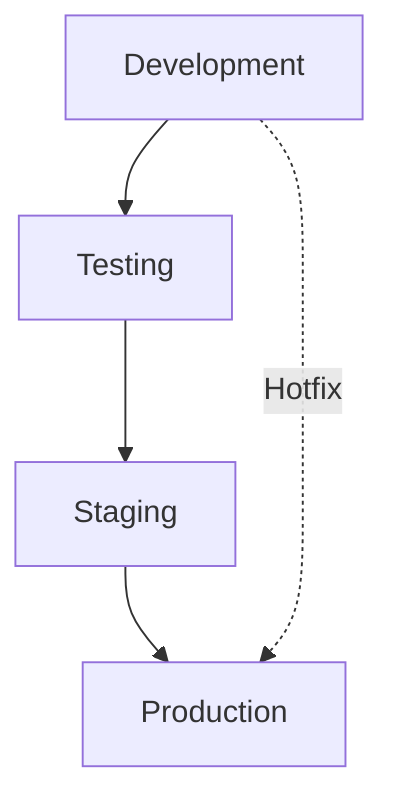
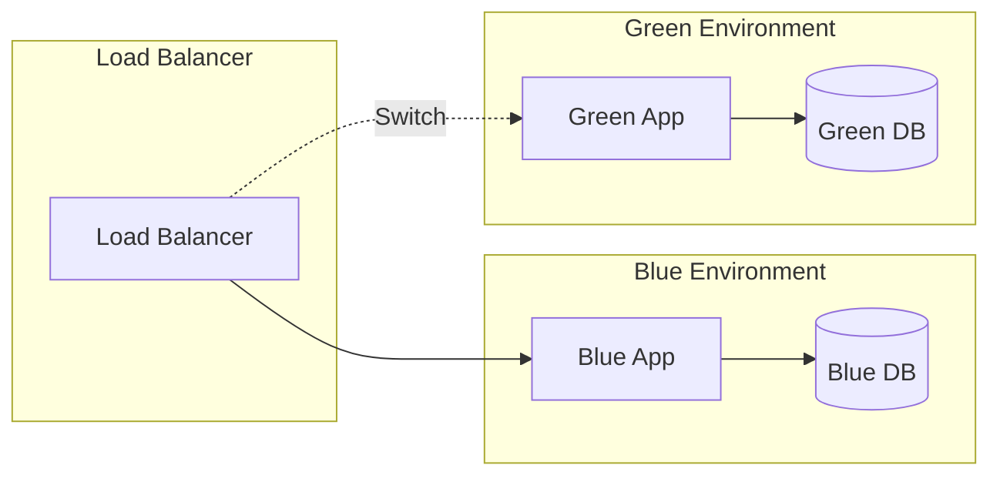
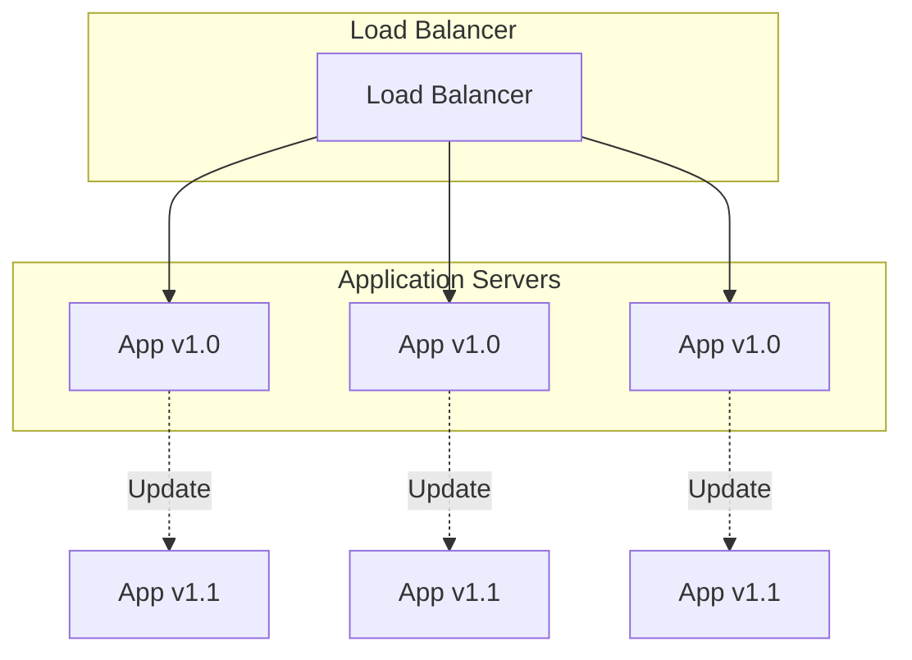

# Deployment Overview

This guide covers the deployment strategies and processes for the Backstage Test Project across different environments.

## Deployment Environments

### Environment Hierarchy



### Environment Characteristics

| Environment | Purpose | Data | Access | Deployment |
|-------------|---------|------|--------|------------|
| **Development** | Local development | Mock data | Developers only | Manual |
| **Testing** | Automated testing | Test data | CI/CD system | Automated |
| **Staging** | Pre-production testing | Production-like data | QA team | Automated |
| **Production** | Live application | Real data | End users | Manual approval |

## Deployment Strategies

### Blue-Green Deployment



**Benefits:**
- Zero-downtime deployments
- Easy rollback capability
- Risk mitigation

**Process:**
1. Deploy new version to green environment
2. Run smoke tests
3. Switch traffic to green environment
4. Monitor for issues
5. Keep blue environment as rollback option

### Rolling Deployment



**Benefits:**
- Gradual rollout
- Reduced risk
- Continuous availability

**Process:**
1. Update one server at a time
2. Wait for health checks
3. Update next server
4. Repeat until all servers updated

## Infrastructure as Code

### Docker Configuration

**Dockerfile:**
```dockerfile
FROM python:3.11-slim

# Set environment variables
ENV PYTHONDONTWRITEBYTECODE=1
ENV PYTHONUNBUFFERED=1

# Set work directory
WORKDIR /app

# Install system dependencies
RUN apt-get update && apt-get install -y \
    postgresql-client \
    && rm -rf /var/lib/apt/lists/*

# Install Python dependencies
COPY requirements.txt .
RUN pip install --no-cache-dir -r requirements.txt

# Copy project
COPY . .

# Collect static files
RUN python manage.py collectstatic --noinput

# Expose port
EXPOSE 8000

# Run the application
CMD ["gunicorn", "--bind", "0.0.0.0:8000", "backstagetest1.wsgi:application"]
```

**docker-compose.yml:**
```yaml
version: '3.8'

services:
  web:
    build: .
    ports:
      - "8000:8000"
    environment:
      - DEBUG=False
      - DATABASE_URL=postgresql://user:password@db:5432/backstagetest1
    depends_on:
      - db
      - redis
    volumes:
      - static_volume:/app/staticfiles
      - media_volume:/app/media

  db:
    image: postgres:14
    environment:
      - POSTGRES_DB=backstagetest1
      - POSTGRES_USER=user
      - POSTGRES_PASSWORD=password
    volumes:
      - postgres_data:/var/lib/postgresql/data

  redis:
    image: redis:7-alpine
    volumes:
      - redis_data:/data

  nginx:
    image: nginx:alpine
    ports:
      - "80:80"
    volumes:
      - ./nginx.conf:/etc/nginx/nginx.conf
      - static_volume:/app/staticfiles
      - media_volume:/app/media
    depends_on:
      - web

volumes:
  postgres_data:
  redis_data:
  static_volume:
  media_volume:
```

### Kubernetes Configuration

**deployment.yaml:**
```yaml
apiVersion: apps/v1
kind: Deployment
metadata:
  name: backstagetest1
  labels:
    app: backstagetest1
spec:
  replicas: 3
  selector:
    matchLabels:
      app: backstagetest1
  template:
    metadata:
      labels:
        app: backstagetest1
    spec:
      containers:
      - name: backstagetest1
        image: backstagetest1:latest
        ports:
        - containerPort: 8000
        env:
        - name: DATABASE_URL
          valueFrom:
            secretKeyRef:
              name: backstagetest1-secrets
              key: database-url
        - name: SECRET_KEY
          valueFrom:
            secretKeyRef:
              name: backstagetest1-secrets
              key: secret-key
        resources:
          requests:
            memory: "256Mi"
            cpu: "250m"
          limits:
            memory: "512Mi"
            cpu: "500m"
        livenessProbe:
          httpGet:
            path: /health/
            port: 8000
          initialDelaySeconds: 30
          periodSeconds: 10
        readinessProbe:
          httpGet:
            path: /health/
            port: 8000
          initialDelaySeconds: 5
          periodSeconds: 5
```

## CI/CD Pipeline

### GitHub Actions Workflow

```yaml
name: Deploy to Production

on:
  push:
    branches: [main]
  pull_request:
    branches: [main]

jobs:
  test:
    runs-on: ubuntu-latest
    steps:
    - uses: actions/checkout@v3
    
    - name: Set up Python
      uses: actions/setup-python@v4
      with:
        python-version: '3.11'
    
    - name: Install dependencies
      run: |
        pip install -r requirements.txt
        pip install -r requirements-dev.txt
    
    - name: Run tests
      run: |
        python manage.py test
        coverage run --source='.' manage.py test
        coverage report
    
    - name: Run linting
      run: |
        flake8 .
        black --check .
        mypy .

  build:
    needs: test
    runs-on: ubuntu-latest
    steps:
    - uses: actions/checkout@v3
    
    - name: Build Docker image
      run: |
        docker build -t backstagetest1:${{ github.sha }} .
        docker tag backstagetest1:${{ github.sha }} backstagetest1:latest
    
    - name: Push to registry
      run: |
        echo ${{ secrets.DOCKER_PASSWORD }} | docker login -u ${{ secrets.DOCKER_USERNAME }} --password-stdin
        docker push backstagetest1:${{ github.sha }}
        docker push backstagetest1:latest

  deploy-staging:
    needs: build
    runs-on: ubuntu-latest
    environment: staging
    steps:
    - name: Deploy to staging
      run: |
        kubectl set image deployment/backstagetest1 backstagetest1=backstagetest1:${{ github.sha }}
        kubectl rollout status deployment/backstagetest1

  deploy-production:
    needs: deploy-staging
    runs-on: ubuntu-latest
    environment: production
    steps:
    - name: Deploy to production
      run: |
        kubectl set image deployment/backstagetest1 backstagetest1=backstagetest1:${{ github.sha }}
        kubectl rollout status deployment/backstagetest1
```

## Environment-Specific Configurations

### Development Environment

**Settings:**
```python
# settings/dev.py
DEBUG = True
ALLOWED_HOSTS = ['localhost', '127.0.0.1']

DATABASES = {
    'default': {
        'ENGINE': 'django.db.backends.sqlite3',
        'NAME': BASE_DIR / 'db.sqlite3',
    }
}

CACHES = {
    'default': {
        'BACKEND': 'django.core.cache.backends.locmem.LocMemCache',
    }
}
```

### Staging Environment

**Settings:**
```python
# settings/staging.py
DEBUG = False
ALLOWED_HOSTS = ['staging.backstagetest1.com']

DATABASES = {
    'default': {
        'ENGINE': 'django.db.backends.postgresql',
        'NAME': 'backstagetest1_staging',
        'USER': 'staging_user',
        'PASSWORD': 'staging_password',
        'HOST': 'staging-db.example.com',
        'PORT': '5432',
    }
}

CACHES = {
    'default': {
        'BACKEND': 'django_redis.cache.RedisCache',
        'LOCATION': 'redis://staging-redis.example.com:6379/1',
    }
}
```

### Production Environment

**Settings:**
```python
# settings/production.py
DEBUG = False
ALLOWED_HOSTS = ['backstagetest1.com', 'www.backstagetest1.com']

DATABASES = {
    'default': {
        'ENGINE': 'django.db.backends.postgresql',
        'NAME': 'backstagetest1_production',
        'USER': 'prod_user',
        'PASSWORD': os.environ.get('DB_PASSWORD'),
        'HOST': 'prod-db.example.com',
        'PORT': '5432',
    }
}

CACHES = {
    'default': {
        'BACKEND': 'django_redis.cache.RedisCache',
        'LOCATION': 'redis://prod-redis.example.com:6379/1',
    }
}

# Security settings
SECURE_SSL_REDIRECT = True
SECURE_HSTS_SECONDS = 31536000
SECURE_HSTS_INCLUDE_SUBDOMAINS = True
SECURE_HSTS_PRELOAD = True
```

## Monitoring and Observability

### Health Checks

**Health Check Endpoint:**
```python
# views.py
from django.http import JsonResponse
from django.db import connection
from django.core.cache import cache

def health_check(request):
    """Comprehensive health check endpoint"""
    health_status = {
        'status': 'healthy',
        'timestamp': timezone.now().isoformat(),
        'checks': {}
    }
    
    # Database check
    try:
        with connection.cursor() as cursor:
            cursor.execute("SELECT 1")
        health_status['checks']['database'] = 'healthy'
    except Exception as e:
        health_status['checks']['database'] = f'unhealthy: {str(e)}'
        health_status['status'] = 'unhealthy'
    
    # Cache check
    try:
        cache.set('health_check', 'ok', 10)
        cache.get('health_check')
        health_status['checks']['cache'] = 'healthy'
    except Exception as e:
        health_status['checks']['cache'] = f'unhealthy: {str(e)}'
        health_status['status'] = 'unhealthy'
    
    return JsonResponse(health_status)
```

### Metrics Collection

**Prometheus Metrics:**
```python
# metrics.py
from prometheus_client import Counter, Histogram, Gauge

# Request metrics
REQUEST_COUNT = Counter('http_requests_total', 'Total HTTP requests', ['method', 'endpoint', 'status'])
REQUEST_DURATION = Histogram('http_request_duration_seconds', 'HTTP request duration')

# Business metrics
USER_REGISTRATIONS = Counter('user_registrations_total', 'Total user registrations')
ACTIVE_USERS = Gauge('active_users', 'Number of active users')

# System metrics
DATABASE_CONNECTIONS = Gauge('database_connections_active', 'Active database connections')
CACHE_HIT_RATIO = Gauge('cache_hit_ratio', 'Cache hit ratio')
```

## Rollback Procedures

### Automated Rollback

```bash
#!/bin/bash
# rollback.sh

PREVIOUS_VERSION=$1
NAMESPACE=${2:-default}

if [ -z "$PREVIOUS_VERSION" ]; then
    echo "Usage: $0 <previous_version> [namespace]"
    exit 1
fi

echo "Rolling back to version: $PREVIOUS_VERSION"

# Update deployment
kubectl set image deployment/backstagetest1 backstagetest1=backstagetest1:$PREVIOUS_VERSION -n $NAMESPACE

# Wait for rollout
kubectl rollout status deployment/backstagetest1 -n $NAMESPACE

# Verify health
kubectl get pods -l app=backstagetest1 -n $NAMESPACE

echo "Rollback completed successfully"
```

### Manual Rollback

1. **Identify Previous Version:**
   ```bash
   kubectl rollout history deployment/backstagetest1
   ```

2. **Rollback to Previous Version:**
   ```bash
   kubectl rollout undo deployment/backstagetest1 --to-revision=2
   ```

3. **Verify Rollback:**
   ```bash
   kubectl rollout status deployment/backstagetest1
   kubectl get pods -l app=backstagetest1
   ```

## Next Steps

- [Local Development Deployment](local.md)
- [Staging Environment Setup](staging.md)
- [Production Deployment Guide](production.md)
